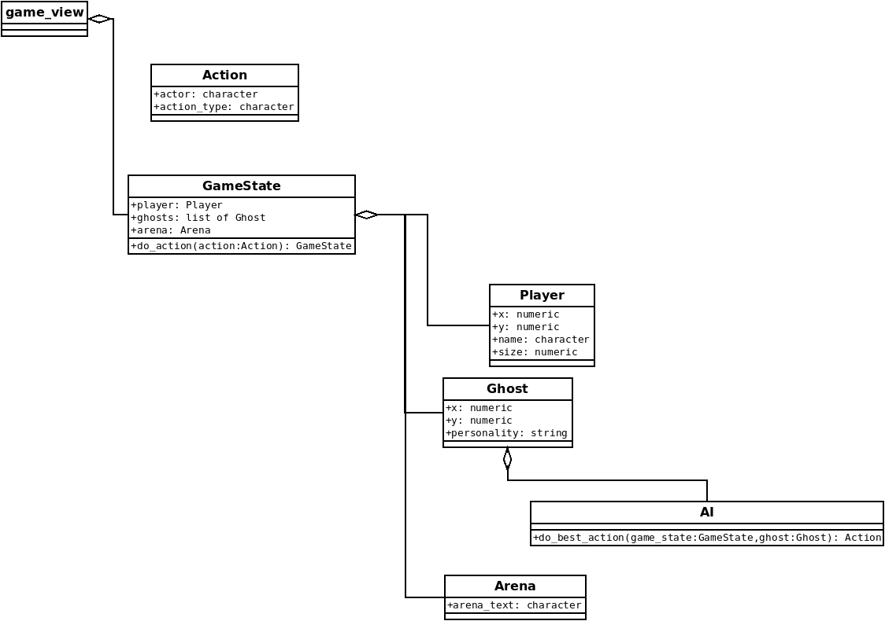

# snackman

Branch   |[GitHub Actions](https://github.com/informalr/snackman/actions)                                     |
---------|-----------------------------------------------------------------------------------------------------|-------------------------------------------------------------------------------------------------------------------------------------------------------
`master` | |
`develop`||
`alexine`||
`bara`   |   |
`claudio`||
`frans`  |  |
`geert`  |  |
`jan`    |    |
`richel` | |
`stefano`||
`willy`  |  |

 * Branches are ordered `master`, `develop`, then topic branches alphabetically

The `informalr` R team!

## Project
Add project description...

## Team

Ordered alphabetically on first name:

Name                                         |Role
---------------------------------------------|-----------------
[Alexine](https://github.com/alexinedewit)   |Junior
[Bara](https://github.com/barawaclawik)      |Newbie
[Claudio](https://github.com/janclod)        |Medior
[Frans](https://github.com/fransbianchi)     |Junior
[Geert](https://github.com/bogeert)          |Junior, back-end
[Jan](https://github.com/janderkkotlarski)   |Newbie
[Lizzie](https://github.com/Lizzie-Roeble)   |Newbie
[Richel](https://github.com/richelbilderbeek)|Team leader
[Stefano](https://github.com/swom)           |Newbie 
[Willy](https://github.com/FrieseWoudloper)  |Medior

## Meetings

 * Date: Tuesday January 5 2021, then every Tuesday
 * Time: 18:00-20:00
 * Where IRL: meeting room 5171.0708, Linnaeusborg, Zernike
 * Where online: Discord.

What                     | Time
-------------------------|------
Richel @ LB main entrance|18:00
Doors open               |18:05
Work starts [1]          |18:15
Break time!              |19:00
Work continues           |19:15
End of lesson            |20:00

 * [1] First thing to do: merge `develop` to your branch, then push your branch

## Coding via Discord

For those that prefer online, we use Discord to chat.
To join, send Richel a Discord Friend Request: `richelbilderbeek#9002`.
He'll add you to the `informalr` server.

## Code of Conduct

See [CODE_OF_CONDUCT.md](CODE_OF_CONDUCT.md).

In case it is undesirable to email Richel,
contact [Willy](https://github.com/friesewoudloper).

## Long-term schedule

ADd info here...

## FAQ

### What is the goal of `informalr`?

To learn how to develop professionally in a team in an informal setting using R.

### What is meant by 'professionally'?

That we follow the literature, which means we will:

 * Use a package as a development unit (not an R script, not a vignette)
 * Use `git` for version control, where each person has his/her own branch
 * Use GitHub for collaboration
 * Employ test-driven development
 * Use Travis CI for continuous integration
 * Use `lintr` to check for style
 * Use `covr` to check for code coverage
 * Use `goodpractice` for miscellaneous good practices

See, for example, [here](https://github.com/richelbilderbeek/PresentationsAboutR)
for multiple videos we will follow.

### What is meant by 'in a team'?

That we work together.
A beginner will be taught by a more experienced team member.
We will be doing pair programming.

### What is meant by 'informal'?

This means that:

 * You are allowed to grab a beer
 * If you cannot be there, this is always fine
 * We only work during our meetings

### How will we do that?

By working on projects as a team. In practice, we will be writing packages.

### What projects will we be working on?

First, we'll write some trivial packages to get used to the workflow.
After this, the team decides on a project by majority vote.

To be precise, you will learn, in this order:

 * `git` minimal workflow: add, clone, commit, pull, push
 * R package minimum: tests, writing trivial functions by copying existing code
 * `git` branching: checkout, merge
 * R package basic: write simple functions, write vignettes
 * Projects

### What should my minimal level be?

There is none.

### I am new, what should I do?

  1. Create a Discord account, send Richel a Discord Friend Request: `richelbilderbeek#9002`, so he can add you to the tresinformal Discord group
  2. Create a GitHub account, share it with a team member so he/she can add you to the `informalr` team

Note: if the Issue is closed, re-open it, assign yourself, 
move the Issue to 'In Progress'. Close the Issue after fixing it. Welcome
to our workflow :+1:

### I work on the pacman app, what should I do?

Golden rules:

 * Whatever you work on, always be assigned to an Issue
 * Whatever code you develop, always be working to fix a test
 * If all tests pass, we are -by definition- happy.

You start out as a junior and gradually move up to medior.

#### Junior

Do some simple Issues to get to know the project.
These are labeled 'Good First Issue'.
These Issues have a test that needs to be fixed.

If there are no such Issues, create an Issue for `richelbilderbeek` to add these :+1:

#### Medior

  * Do some harder Issues. These Issues may or may not have a test yet. 
    If there is no test, write that test first and have it reviewed.
  * Create an Issue with a new feature. 
    Write down the test in the Issue.
    After this, you can assign yourself to this new Issue.

#### Related projects

Add here some related project...

### Misc

 * Shiny tutorial: https://github.com/FrieseWoudloper/shiny-workshop

## Progress

